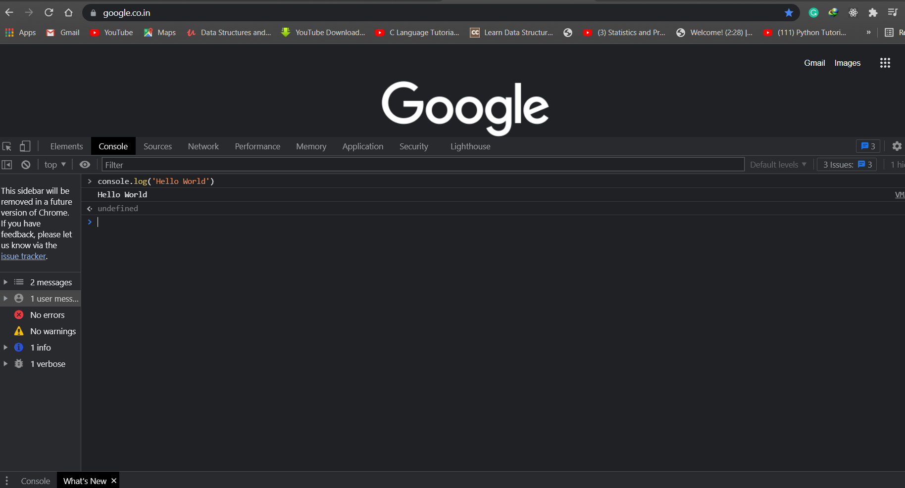

## Building Blocks of Programming Language

<br>

#### These are some of the building blocks of a programming language:
- Variables
- Data Types
- Operators
- Expressions


## <center><b><u>Variables</u></b></center>
Variables are used to store some data for  later use. In other words think of them as containers which hold whatever data you put inside them.
<br>
<br>
To write variable we have to do this
```
var num1 = 3;
var num2 = 4;
var num3 = 13;

var sum = num1 + num2 + num3;
```

## <center><b><u>Operators</u></b></center>

Operators are symbols used to perform some actions on variables. In this case the plus operator is used add all three values from the variables.

JavaScript supports many operators like plus(+), minus(-), multiply(*), divide(/), comparision etc.

<b>How to print something on JavaScript ?</b>

```
console.log('Hello World!');
```


<br>
<br>
<br>

> If you want to run JavaScript after clearing the console. You can write this :~

```
console.clear()
```

## <center><b><u>Data Types</u></b></center>

Data Types tells JavaScript what type of value we have stored in our variables.There are many data types in JavaScript, these Number and String are also data types. JavaScript also has few other data types like Boolean, Null, Undefined, Objects etc.


### <b>Some convensions to declare variable names</b>
1. Naming Convension :- 
- Camel case
```
var firstName;
```
- Pascal case
```
var FirstName;
```
- Snake case
```
var first_name;
```

2. RUles for naming JS variables
-  Name can contain letter, digits, _ and $.
```
var mySubject1 // right convension

var mySubject_ // right convension

var mySubject$ // right convension
```

- Name can't start with a digit
```
var 1mySubject // wrong convension
```

- Name can start with an _ or $
```
var _mySubject // right convension

var $mySubject // right convension
```

- Names are case sensitive
```
var a,A // these are different variable ,hence case sensitive
```

- Names cannot be reserved keywords

```
var if // wrong convension because if is a reserved keyword
```
